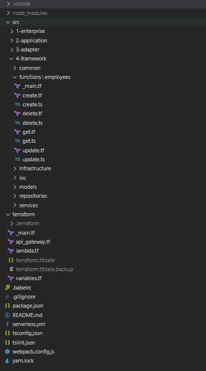
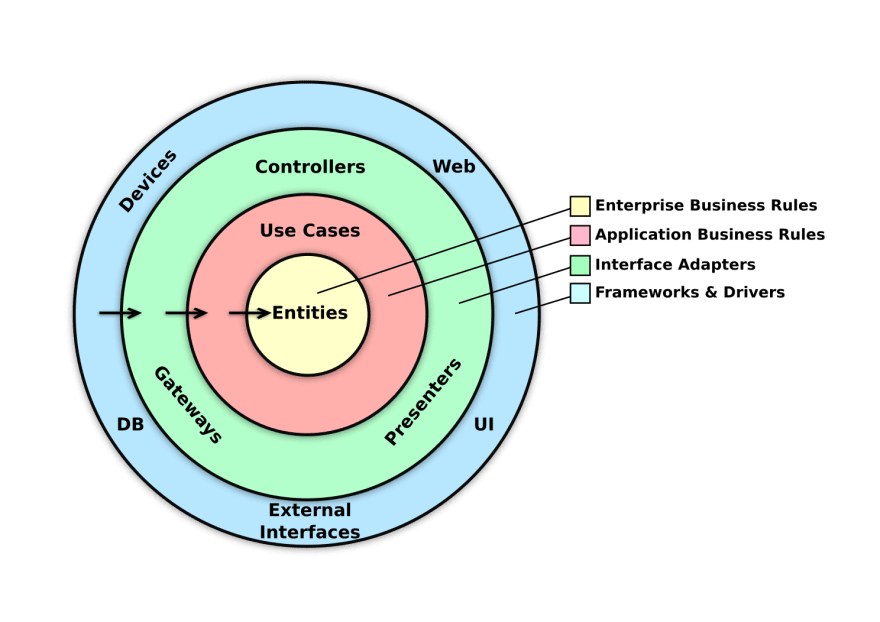

# Terraform Lambda Typescript Architecture
proof of concept about terraform building serverless using aws provider

## Clean Architecture
  

## Use case 
- Terraform
- Typescript
- TSLint
- Webpack
- Typedi
- Babel
- Dynamoose (Provider DynamoDB)

## Deployment 🚀
 - Run `yarn build` webpack package
 - Run `tf:init` initialize terraform
 - Run `tf:validate` validate template terraform
 - Run `tf:plan` view changes about terraform
 - Run `tf:apply` apply changes about terraform
 - Run `tf:destroy` delete resources
 - Run `yarn deploy` provisioned resources on aws provider
 - Run `yarn cleanup` clean build webpack
 - Run `yarn test` test
 - Run `yarn lint` check project clean code

## Steps 
 1. Install Terraform `https://learn.hashicorp.com/tutorials/terraform/install-cli`
 2. Install Node `https://nodejs.org/en/download/`
 3. Run `npm install --global yarn`
 4. Run `yarn` inside the project
 5. Run `yarn deploy` inside the project
